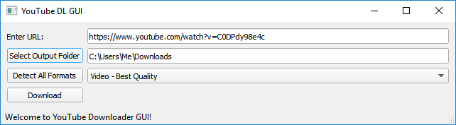

# youtube_dl_GUI

youtube_dl_GUI is intended to serve as a basic interface for downloading YouTube videos/audio tracks/playlists that can be easily shared and used by non-programmers. youtube_dl_GUI can be run as a standalone .exe by running `/dist/youtube_dl_GUI.exe`

## GUI Application Usage
1. Run standalone [youtube_dl_GUI.exe](/dist/youtube_dl_GUI.exe) in the `/dist` folder. (Alternatively, you can run the python code youtube_dl_GUI.py - setup in "Developer Setup" section below)
1. Enter the URL of the video / playlist you want to download into the top "URL" textbox.
1. Then enter the folder to save the video to in the "Output Folder" textbox. 
1. Next choose the video format
    1. To download the highest quality of video, select the video format `Video - Best Quality`
    1. If you only want the audio (saved as .mp3), select `Audio Only - Best Quality`
    1. If you want a specific video format, click the `Detect All Formats` button, which will fetch the available video formats and populate the dropdown with the available formats. Warning: some of these formats may be video only or audio only!
1. Click the Download button. Output will display to the console.

## Developer Setup (PyQT GUI App)
Just set up Python3 with libraries PyQT5 (`pip install pyqt5`) and youtube_dl (`pip install youtube-dl`), and you should be able to run the code.

### Build Windows .exe with PyInstaller

To build the code into an .exe using PyInstaller (easier to do this in an virtual environment):
1. Install PyInstaller: `pip install pyinstaller`
1. Make sure you have PyQT5 and youtube_dl installed
1. cd to the directory containing youtube_dl_GUI.py
1. Run command: `pyinstaller.exe youtube_dl_GUI.py --onefile --hidden-import PyQt5.sip`

### Troubleshooting
Make sure you have the latest version of the code! Youtube changes things frequently, so use the latest version of the executable in this repository. If you are a developer, use `pip install --upgrade youtube-dl`in the command line to make sure you have the latest library version.

## FastAPI Web Application Developer Usage
1. Make sure you have the Python 3.6+ with proper libraries installed with `pip install -r fastapi_requirements.txt`
2. Start the webserver with `python server.py` or `uvicorn server:app --reload`
3. Open `localhost:8000` in your web browser (HTML templating is kept basic for demo purposes).
4. API documentation located at `localhost:8000/docs`
