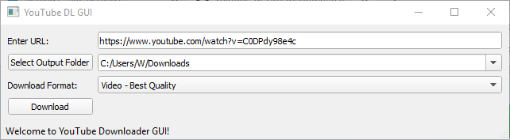

# youtube_dl_GUI

youtube_dl_GUI is intended to serve as a basic interface for downloading YouTube videos/audio tracks/playlists that can be easily shared and used by non-programmers. youtube_dl_GUI can be run as a standalone .exe by running /dist/youtube_dl_GUI.exe

## UPDATE
As of Oct 28 2020, the Youtube-dl library has been taken down in response to a RIAA DMCA takedown notice, and the latest version of the library (Sept 20, 2020 release) no longer is no longer compatible with Youtube. As such, this repository has been migrated to the [Youtube-dlc](https://github.com/blackjack4494/yt-dlc) fork (which has not been DMCA'd and is still actively maintained). End users of this repository shouldn't notice any changes.

### Usage
1. Run standalone youtube_dl_GUI.exe in the /dist folder. Alternatively, you can run the python code youtube_dl_GUI.py 
1. Enter the URL of the video you want to download into the top "URL" textbox.
1. Then enter the folder to save the video to in the "Output Folder" textbox. 
1. Next choose the video format
    1. To download the highest quality of video, select the video format `Video - Best Quality`
    1. If you only want the audio (saved as .mp3), select `Audio Only - Best Quality`
    1. If you want another video format, click the `Detect All Formats` button, which will fetch the available video formats and populate the dropdown with the available formats. Warning: some of these formats may be video only or audio only!
1. Click the Download button. Output will display to the console.

### Troubleshooting
Make sure you have the latest version of youtube-dlc! Youtube changes things frequently, so use the latest version of the executable in this repository. If you are a developer, use `pip install --upgrade youtube-dlc`in the command line.

### Developer Setup
Just set up Python3 with libraries PyQT5 (`pip install pyqt5`) and youtube_dlc (`pip install youtube-dlc`), and you should be able to run the code.

To build the code into an .exe using PyInstaller (easier to do this in an Anaconda environment):
1. Install PyInstaller: `pip install pyinstaller`
1. Make sure you have PyQT5 and youtube_dlc installed
1. cd to the directory containing youtube_dl_GUI.py
1. Run command: `pyinstaller.exe youtube_dl_GUI.py --onefile --hidden-import PyQt5.sip`
